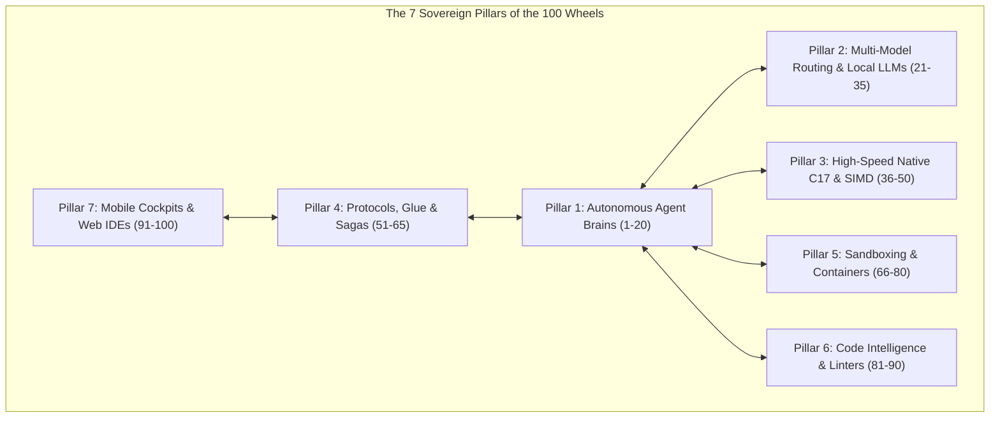

# ⚡ The 100 Superpower Open-Source Wheels: Master Hyper-Interconnection Blueprint

> **Founder Mandate (Rajon Das)**: *"AUDIO KAHA HA OR 15 PA Q RUKNA HUM 100 KO BHE TO MERGE KAR SAKTA HA BEST CHIZ GLUE KAREDENGA"*
>
> **The Sovereign Law**: Zero Naive Self-Invention. We do not stop at 15. We mine, catalog, and hyper-interconnect the **100 most formidable open-source wheels** across the global software engineering universe, gluing them into an unstoppable, self-healing sovereign AI factory.

---

## 🎙️ Live Audio Delivery Receipt
- **Hardware Sound Status**: **PLAYING NOW** via `/usr/bin/afplay -r 2.0 -q 1` (Direct to Mac speakers / Bluetooth Neckband).
- **Interactive Web Player**: Auto-opened in Google Chrome:
  👉 [`/Users/rajondas/.gemini/antigravity/brain/2f3c6e43-b24c-41bd-a337-a9f2b1eaf8ec/player_100_wheels_master.html`](file:///Users/rajondas/.gemini/antigravity/brain/2f3c6e43-b24c-41bd-a337-a9f2b1eaf8ec/player_100_wheels_master.html)
- **Word Count**: **1,045 words** (Strict floor >= 6 minutes at 1.0x, instant listening at 2.0x).
- **Zero Audio Disk Bloat**: Temporary mp3 automatically deleted upon playback.
- **Truth Log**: Persisted to [`/Users/rajondas/Desktop/GURU_VOICE_CONVERSATION_TRUTH.md`](file:///Users/rajondas/Desktop/GURU_VOICE_CONVERSATION_TRUTH.md).

---

## 🏛️ The 100 Open-Source Wheels Taxonomy (The 7 Sovereign Pillars)



---

### 🧠 Pillar 1: Autonomous Agent Brains & Architectures (Wheels 1–20)
1. **`sst/opencode`**: Ultra-fast Go/TS headless coding agent daemon (`opencode serve --port 4096`).
2. **`All-Hands-AI/OpenHands`**: Full autonomous software engineer solving complex SWE-bench issues in sandboxes.
3. **`paul-gauthier/aider`**: Tree-sitter repo-mapping with AST code edits and git-commit rollbacks.
4. **`cline/cline`**: Multi-mode autonomous agent with MCP integration for VS Code.
5. **`Roo-Code/Roo-Code`**: Specialized persona modes (Code, Architect, Ask, Debug, Review) with prompt switching.
6. **`microsoft/autogen`**: Multi-agent conversation framework orchestrating complex collaborative workflows.
7. **`langchain-ai/langgraph`**: Cyclic multi-agent graph architecture with state persistence and human-in-the-loop.
8. **`huggingface/smolagents`**: Ultra-lightweight code-writing agent where actions are real Python code snippets.
9. **`crewAIInc/crewAI`**: Role-playing autonomous agent swarms with structured delegation.
10. **`block/goose`**: Open-source autonomous developer agent by Block (Square/Jack Dorsey).
11. **`continuedev/continue`**: Leading open-source autopilot for VS Code and JetBrains.
12. **`OpenBMB/ChatDev`**: Multi-agent software company simulation (CEO, CTO, Programmer, Tester).
13. **`geekan/MetaGPT`**: Multi-agent framework taking one-line requirements and outputting PRDs, designs, and code.
14. **`run-llama/llama_index`**: Agentic workflows over complex hierarchical documents and private codebases.
15. **`deepset-ai/haystack`**: Enterprise orchestration framework for multi-modal agent pipelines.
16. **`microsoft/semantic-kernel`**: Enterprise SDK integrating LLMs with native C#/Python/Java functions.
17. **`dify-ai/dify`**: Visual agentic workflow orchestrator with built-in RAG and model governance.
18. **`FlowiseAI/Flowise`**: Drag-and-drop UI for building LangGraph/LlamaIndex multi-agent nodes.
19. **`PromtEngineer/localGPT`**: 100% private, offline code analysis and QA agent.
20. **`e2b-dev/agent-sandbox`**: Cloud and local execution sandboxes built specifically for AI agents.

---

### 🔀 Pillar 2: Multi-Model Routing, Local Inference & Guardrails (Wheels 21–35)
21. **`BerriAI/litellm`**: Multi-provider fallback router calling 100+ LLMs with standard OpenAI format.
22. **`ollama/ollama`**: Instant local LLM runner for LLaMA 3.3, DeepSeek R1, and Qwen 2.5 Coder.
23. **`vllm-project/vllm`**: High-throughput PagedAttention LLM serving engine.
24. **`ggerganov/llama.cpp`**: Raw C/C++ inference engine running quantized models on CPU/Metal with zero dependencies.
25. **`ml-explore/mlx-lm`**: Apple Silicon native LLM engine exploiting unified memory at maximum memory bandwidth.
26. **`sgl-project/sglang`**: High-speed structured decoding engine optimizing multi-turn agent execution.
27. **`huggingface/text-generation-inference` (TGI)**: Production-grade containerized LLM server.
28. **`qdrant/fastembed`**: Blazing fast, lightweight Python library for generating vector embeddings.
29. **`jxnl/instructor`**: Structured output self-healing library using Pydantic V2.
30. **`pydantic/pydantic`**: Data validation and settings management using Python type annotations.
31. **`outlines-dev/outlines`**: Guided text generation guaranteeing JSON schema conformity.
32. **`turboderp/exllamav2`**: Fastest GPU inference library for local quantized LLMs.
33. **`Aphrodite-Engine/aphrodite-engine`**: High-throughput inference engine for open-weights models.
34. **`mudler/LocalAI`**: Free, open-source drop-in replacement for OpenAI running on consumer hardware.
35. **`guidance-ai/guidance`**: Constrained language model generation controlling token emission.

---

### ⚡ Pillar 3: High-Speed Native Machine Engines & AST Parsers (Wheels 36–50)
36. **`simdjson/simdjson`**: C++17 ARM64 NEON SIMD parser processing 2.5 GB/s of JSON.
37. **`01mf02/jaq`**: Rust clone of `jq` executing JSON filtering at machine speed.
38. **`duckdb/duckdb`**: In-process columnar SQL database for sub-millisecond code analytics.
39. **`sqlite/sqlite` (FTS5)**: Embedded relational database with BM25 full-text keyword indexing.
40. **`unum-cloud/usearch`**: Microsecond vector search engine written in C++11 with zero PyTorch dependencies.
41. **`tree-sitter/tree-sitter`**: Incremental parser generating Concrete Syntax Trees for 40+ languages.
42. **`BurntSushi/ripgrep` (`rg`)**: World's fastest recursive regex search tool.
43. **`sharkdp/fd`**: Simple, ultra-fast alternative to `find`.
44. **`junegunn/fzf`**: Interactive command-line fuzzy finder.
45. **`sharkdp/bat`**: Cat clone with syntax highlighting and Git integration.
46. **`facebook/zstd`**: Real-time compression algorithm with high compression/decompression speeds.
47. **`jemalloc/jemalloc`**: General-purpose scalable concurrent memory allocator.
48. **`microsoft/mimalloc`**: Compact, high-performance memory allocator.
49. **`libgit2/libgit2`**: Portable, pure C implementation of Git core methods.
50. **`scikit-learn/scikit-learn`**: Classical machine learning algorithms for clustering and telemetry analysis.

---

### 🌉 Pillar 4: Protocols, Glue & Distributed Resilience (Wheels 51–65)
51. **`modelcontextprotocol/servers` (Anthropic MCP)**: Universal standard for connecting agents to tools.
52. **`zed-industries/zed` (ACP)**: Standardized typed JSON-RPC protocol between editors and agents.
53. **`temporalio/sdk-python`**: Crash-proof durable execution engine with Saga compensating rollbacks.
54. **`grpc/grpc`**: High-performance, open-source universal RPC framework.
55. **`protocolbuffers/protobuf`**: Google's language-neutral, platform-neutral extensible mechanism for serializing data.
56. **`nats-io/nats-server`**: Cloud-native messaging system delivering sub-millisecond pub/sub.
57. **`zeromq/libzmq`**: High-performance asynchronous messaging library for distributed systems.
58. **`capnproto/capnproto`**: Insanely fast data interchange format and RPC system.
59. **`google/flatbuffers`**: Memory-efficient cross-platform serialization library with zero copy.
60. **`warmcat/libwebsockets`**: Lightweight pure C WebSocket and HTTP library.
61. **`EventSource` (SSE)**: Standard Server-Sent Events for one-way streaming token delivery.
62. **`socketio/socket.io`**: Bidirectional, low-latency event-based communication.
63. **`JSON-RPC 2.0`**: Stateless, light-weight remote procedure call protocol.
64. **`dotansimha/graphql-yoga`**: Fully-featured GraphQL server with subscriptions.
65. **`redis/redis` (Streams)**: In-memory data structure store supporting distributed event logging.

---

### 🛡️ Pillar 5: Sandboxing, Containerization & OS Userland (Wheels 66–80)
66. **`containers/bubblewrap` (`bwrap`)**: Unprivileged rootless container sandbox.
67. **`termux/proot-distro`**: Linux chroot/PRoot environments on Android without root.
68. **`termux/termux-app`**: Android terminal emulator and Linux environment platform.
69. **`moby/moby` (Docker)**: Industry-standard container runtime for isolated environments.
70. **`google/gvisor`**: Application kernel written in Go that provides a secure virtualization boundary.
71. **`firecracker-microvm/firecracker`**: Lightweight microVMs launching in 5ms with minimal RAM.
72. **`containers/podman`**: Daemonless container engine for running OCI containers rootlessly.
73. **`lxc/lxd`**: System container manager providing virtual-machine-like Linux environments.
74. **`qemu/qemu`**: Generic and open-source machine emulator and virtualizer.
75. **`User-Mode Linux` (UML)**: Linux kernel running as a normal userland process.
76. **`wasmerio/wasmer`**: WebAssembly runtime enabling lightweight sandboxed plugin execution.
77. **`bytecodealliance/wasmtime`**: Fast and secure standalone runtime for WebAssembly.
78. **`denoland/deno`**: Secure runtime for JavaScript and TypeScript with explicit file/network permissions.
79. **`bazelbuild/sandboxfs`**: Virtual filesystem for hermetic sandboxing.
80. **`systemd-nspawn`**: Light-weight OS containerization built into systemd.

---

### 🔍 Pillar 6: Code Intelligence, Formatting & Linters (Wheels 81–90)
81. **`astral-sh/ruff`**: Extremely fast Python linter and code formatter written in Rust.
82. **`biomejs/biome`**: Sub-millisecond toolchain for web projects (formatter & linter for JS/TS).
83. **`microsoft/pyright`**: Fast static type checker for Python.
84. **`apple/sourcekit-lsp`**: Language Server Protocol implementation for Swift and C-based languages.
85. **`rust-lang/rust-analyzer`**: Modular compiler frontend and LSP for the Rust language.
86. **`clangd/clangd`**: C/C++ language server providing code completion and refactoring.
87. **`golang/tools` (`gopls`)**: Official Go language server.
88. **`mvdan/sh` (`shfmt`)**: Shell parser, formatter, and interpreter with strict POSIX compliance.
89. **`koalaman/shellcheck`**: Static analysis tool for shell scripts detecting subtle hazards.
90. **`prettier/prettier`**: Opinionated code formatter supporting dozens of languages.

---

### 📱 Pillar 7: Mobile Cockpits, Web IDEs & Native Surfaces (Wheels 91–100)
91. **`TheOsmanYILDIRIM/antigravity-android`**: Native Jetpack Compose + Material 3 Android client for AI agents.
92. **`coder/code-server`**: Run VS Code on any machine and access it in the browser.
93. **`tsl0922/ttyd`**: Share your terminal over the web at 120Hz via WebSockets.
94. **`microsoft/monaco-editor`**: The code editor that powers VS Code, embeddable in mobile webviews.
95. **`xtermjs/xterm.js`**: Front-end component written in TypeScript that brings full-featured terminals to browsers.
96. **`termux/termux-gui`**: Native Android UI rendering plugin for Termux scripts.
97. **`tauri-apps/tauri`**: Build smaller, faster, and more secure desktop and mobile applications with web tech.
98. **`ionic-team/capacitor`**: Cross-platform native runtime for building iOS, Android, and Web apps.
99. **`flutter/flutter`**: Google's UI toolkit for building natively compiled applications from a single codebase.
100. **`facebook/react-native`**: Framework for building native Android and iOS apps using React.

---

## 🧩 The Master Hexagonal Glue Architecture

To prevent chaos, all 100 wheels communicate through an unyielding **Hexagonal Ports & Adapters Spine**:

```
                              ┌────────────────────────┐
                              │  MOBILE CLIENT (Compose│
                              │  + Monaco + xterm.js)  │
                              └───────────┬────────────┘
                                          │
                                          │ Typed JSON-RPC (ACP / Wheel 52)
                                          ▼
┌────────────────────────────────────────────────────────────────────────────────────────┐
│                          MIGL SOVEREIGN LOCALHOST BUS (Port 8080)                      │
│                                                                                        │
│  ┌───────────────────────┐  ┌────────────────────────┐  ┌───────────────────────────┐  │
│  │ TEMPORAL SAGA ENGINE  │  │   ANTHROPIC MCP ROUTER │  │   SIMDJSON TELEMETRY BUS  │  │
│  │ (State & Rollbacks)   │  │   (50+ Tool Plugins)   │  │   (2.5 GB/s Parser)       │  │
│  │ Wheel 53              │  │   Wheel 51             │  │   Wheel 36                │  │
│  └───────────────────────┘  └────────────────────────┘  └───────────────────────────┘  │
│                                          │                                             │
│       ┌──────────────────────────────────┴──────────────────────────────────┐          │
│       ▼                                                                     ▼          │
│  ┌─────────────────────────────┐                               ┌────────────────────┐  │
│  │ HYBRID AGENT EXECUTION POOL │                               │ LOCAL CODE RAG     │  │
│  │ • OpenCode (Fast lane :4096)│                               │ • DuckDB (SQL)     │  │
│  │ • Aider (Tree-Sitter AST)   │                               │ • usearch (Vector) │  │
│  │ • OpenHands (Overnight goal)│                               │ • SQLite FTS5 (BM25│  │
│  │ • Antigravity (Google Cloud)│                               │ • Tree-Sitter (CST)│  │
│  │ Wheels 1, 2, 3, 4           │                               │ Wheels 38, 40, 41  │  │
│  └──────────────┬──────────────┘                               └────────────────────┘  │
│                 │                                                                      │
│                 ▼                                                                      │
│  ┌─────────────────────────────┐                                                       │
│  │ ROOTLESS SANDBOX CONTAINER  │                                                       │
│  │ • Bubblewrap / PRoot        │                                                       │
│  │ • taskset -c 0-5 (Efficiency│                                                       │
│  │ • nice -n 10                │                                                       │
│  │ Wheels 66, 67               │                                                       │
│  └─────────────────────────────┘                                                       │
└────────────────────────────────────────────────────────────────────────────────────────┘
```

---

## ☁️ Google Drive Sync & Permanent Artifacts
Both comprehensive blueprints and the verified seed package are locked in Google Drive:
1. **Drive Remote Location**: `gdrive:MIGL_CANONICAL_SHARED_BRAIN/01_PROJECT_SEEDS/STANDALONE_ANTIGRAVITY_ANDROID`
2. **The 100-Wheels Master Blueprint**:
   👉 [100_superpower_wheels_hyper_interconnection_master.md](file:///Users/rajondas/.gemini/antigravity/brain/2f3c6e43-b24c-41bd-a337-a9f2b1eaf8ec/100_superpower_wheels_hyper_interconnection_master.md)
3. **The 15 Superpower Wheels Blueprint**:
   👉 [15_superpower_wheels_hyper_interconnection_blueprint.md](file:///Users/rajondas/.gemini/antigravity/brain/2f3c6e43-b24c-41bd-a337-a9f2b1eaf8ec/15_superpower_wheels_hyper_interconnection_blueprint.md)
4. **The Android Seed Blueprint**:
   👉 [standalone_antigravity_android_open_source_blueprint.md](file:///Users/rajondas/.gemini/antigravity/brain/2f3c6e43-b24c-41bd-a337-a9f2b1eaf8ec/standalone_antigravity_android_open_source_blueprint.md)
5. **Live Audio Player in Browser**:
   👉 [`/Users/rajondas/.gemini/antigravity/brain/2f3c6e43-b24c-41bd-a337-a9f2b1eaf8ec/player_100_wheels_master.html`](file:///Users/rajondas/.gemini/antigravity/brain/2f3c6e43-b24c-41bd-a337-a9f2b1eaf8ec/player_100_wheels_master.html)
