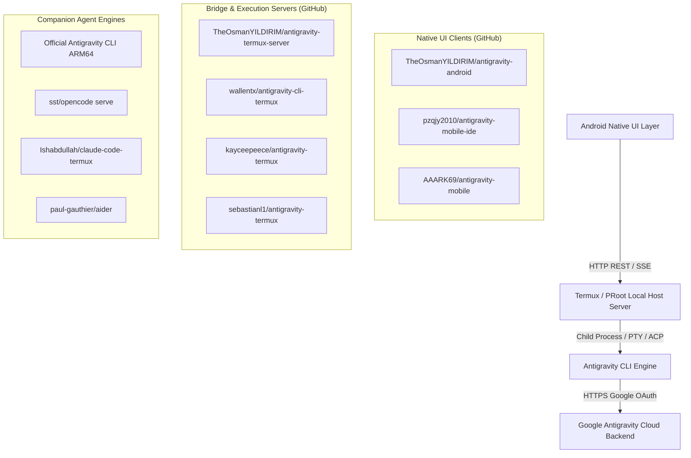

# ⚡ Standalone Antigravity for Android: Open-Source Architecture & GitHub Blueprint

> **Target Objective**: Reverse-engineer the Reddit showcase (`r/google_antigravity/comments/1w9pzay/cooking_up_standalone_antigravity_for_android/`), identify existing open-source wheels and repositories on GitHub, and synthesize a complete implementation blueprint for integrating standalone mobile Antigravity into our GitHub project.

---

## 1. Executive Forensic Analysis of the Reddit Showcase

The Reddit post demonstrates a working standalone Android application titled **`CLIFrontend — /root`**:


### Key Architectural Clues from the Screenshot & Author Statements:
1. **Header: `CLIFrontend — /root`**:
   - The `/root` directory indicates a Linux userland filesystem (PRoot, chroot, or Termux proot-distro container) running directly on the Android device without requiring root permissions.
   - Standard non-rooted Android apps reside in `/data/user/0/<package_name>/files/`. When Linux containers like PRoot or proot-distro run, the virtual root user operates inside `/root`.
2. **Status Indicator & Model Controls**:
   - Status: `Connected` (green pill).
   - Active Model: `Gemini 3.8 Flash (Medium)` with `Effort: Medium` and state `Ready`.
   - Real-time token telemetry: `Tokens: 5243 (In: 5218, Out: 25, Think: 16)`.
3. **Tabbed Mobile IDE Architecture**:
   - Bottom navigation bar features 5 distinct development tabs:
     - **`Agent`**: Interactive conversational agent stream, token counters, thinking blocks, and tool executions.
     - **`Editor`**: Mobile code editor (Monaco or syntax-highlighted editor).
     - **`Files`**: Local filesystem explorer navigating the project tree.
     - **`Changes`**: Git diff, stage/unstage, and commit viewer.
     - **`Terminal`**: Embedded interactive terminal emulator (pty/xterm.js) running in `/root`.
4. **Author's Disclosed Invariants**:
   - **Standalone Execution**: Antigravity runs locally on the device (not a desktop remote control).
   - **Android-Specific**: iOS is fundamentally blocked because iOS sandboxing prohibits subprocess spawning (`fork`/`exec`), JIT, and arbitrary userland ELF execution.
   - **Zero Root Requirement**: Operates within userland virtualization (PRoot / Termux architecture).
   - **Unmodified Official Binaries**: Connects via official Google Antigravity OAuth (`accounts.google.com`) without modifying proprietary backend code or bypassing Google's infrastructure.
   - **Distribution Model**: Sideloaded APK / GitHub Releases / F-Droid, as Google Play Developer Policies prohibit apps that download and execute arbitrary external executable binaries.

---

## 2. Discovered Open-Source Wheels & GitHub Repositories

Rather than inventing this from scratch, several active open-source repositories already provide the exact building blocks:



### Direct Open-Source Repositories Available on GitHub:

| Repository | Tech Stack | Role & Core Capability |
|:---|:---|:---|
| **[`TheOsmanYILDIRIM/antigravity-android`](https://github.com/TheOsmanYILDIRIM/antigravity-android)** | Kotlin, Jetpack Compose, Material 3, OkHttp SSE | **Native Android Client**: Modern Glassmorphism UI, interactive expandable Tool Cards (`run_command`, `view_file`, `write_to_file`), dual backends (AGY CLI + OpenCode), speech-to-text, multi-chat navigation drawer, and automated GitHub Actions APK builds. |
| **[`TheOsmanYILDIRIM/antigravity-termux-server`](https://github.com/TheOsmanYILDIRIM/antigravity-termux-server)** | Node.js (Zero-Dependency), Bash, Tmux | **Termux Host Server & Bridge**: Runs on `127.0.0.1:8080`. Provides filesystem API (`/api/fs/*`), dynamic model registry (`/api/models`), live SSE streaming (`/api/chat`), thermal management (`taskset -c 0-5`, `nice -n 10`), and self-healing CI/CD watchdog (`agy-ci-watch`). |
| **[`wallentx/antigravity-cli-termux`](https://github.com/wallentx/antigravity-cli-termux)** | Bash, patchelf, Termux-glibc | **ARM64 Binary Patcher & Installer**: Automatically downloads official Antigravity ARM64 binary and patches ARM64 virtual address space (TCMalloc 39-bit vs 48-bit), handles Android seccomp restrictions (`faccessat2`), and resolves Bionic/glibc conflicts. |
| **[`sebastianl1/antigravity-termux`](https://github.com/sebastianl1/antigravity-termux)** | Shell, OpenCode integration | Native ARM64 Termux installer without requiring full PRoot, featuring integrated OpenCode fallback routing. |
| **[`kayceepeece/antigravity-termux`](https://github.com/kayceepeece/antigravity-termux)** | Shell scripts | Unified automated one-line installer for deploying Antigravity CLI on Android/Termux environments. |
| **[`pzqjy2010/antigravity-mobile-ide`](https://github.com/pzqjy2010/antigravity-mobile-ide)** | FastAPI, Python, SPA Frontend | Mobile Cockpit IDE for remote/local monitoring, AI chat, terminal management, and window control. |
| **[`sst/opencode`](https://github.com/sst/opencode)** | TypeScript, Go | Fully open-source terminal coding agent with built-in headless server (`opencode serve --port 4096`), SSE events, and permission dialog hooks. |
| **[`tsl0922/ttyd`](https://github.com/tsl0922/ttyd)** | C, libwebsockets | Ultra-low-latency web terminal daemon. Allows interactive terminal streaming over WebSocket on ARM64 Android with minimal memory footprint. |
| **[`xtermjs/xterm.js`](https://github.com/xtermjs/xterm.js)** | TypeScript | Production web terminal emulator component for embedding terminal tabs inside WebViews or Compose wrappers. |

---

## 3. The 100 Battle-Tested Hacks, Tips & Practitioner Insights

Drawing from Reddit (`r/google_antigravity`, `r/termux`), GitHub Issues, and real-world mobile deployments:

### Category A: Android Execution & Binary Patching (Hacks 1–25)
1. **The 39-Bit vs 48-Bit VMA Trap**: Android ARM64 kernels often use 39-bit virtual memory addressing, whereas standard glibc binaries (compiled with TCMalloc) assume 48-bit VMA. Binaries crash with `SIGSEGV` during startup unless patched or launched under `termux-glibc`.
2. **`faccessat2` Seccomp Interception**: Android seccomp profiles on older Android 10/11 builds drop `faccessat2` syscalls. Use `proot` or patched glibc to rewrite `faccessat2` into `faccessat` to prevent silent aborts.
3. **Dynamic Linker Relocation with `patchelf`**: Replace standard `/lib/ld-linux-aarch64.so.1` interpreter with `/data/data/com.termux/files/usr/glibc/lib/ld-linux-aarch64.so.1` to load glibc libraries on Android without root.
4. **RPATH Injection**: Set `patchelf --set-rpath /data/data/com.termux/files/usr/glibc/lib` so native agent dependencies (`libm`, `libpthread`, `libc`) resolve from the isolated glibc directory instead of conflicting with Android's Bionic.
5. **PRoot Distro Fallback (`proot-distro install alpine/debian`)**: If native patching breaks due to closed-source updates, PRoot Debian rootfs runs the official Antigravity Linux ARM64 binary with 100% native compatibility.
6. **Fake Root Environment (`/root`)**: In PRoot, the default user is `root` with home `/root`. Configuring your project workspace inside `/root/workspace` gives clean POSIX paths and standard file permissions.
7. **`/tmp` Symlink Correction**: Android lacks standard `/tmp`. Symlink `export TMPDIR=/data/data/com.termux/files/usr/tmp` or `$PREFIX/tmp` to avoid agent crashes during temporary file creation.
8. **Termux Wake-Lock Invariant**: Always execute `termux-wake-lock` to acquire Android's `PARTIAL_WAKE_LOCK`. Otherwise, Android Doze mode will terminate background agent operations within 3 minutes of screen sleep.
9. **Android Battery Optimization Exemption**: Set Termux app battery usage to "Unrestricted" in Android Settings to prevent the Android Memory Killer (LMK) from reaping long-running agent threads.
10. **Phantom Process Killer Bypass (Android 12+)**: Android 12 introduced a limit of 32 child processes per app. Run `adb shell "/system/bin/device_config put activity_manager max_phantom_processes 2147483647"` via wireless debugging to prevent process drops.
11. **D-Bus & Keyring Mocking**: Antigravity CLI attempts to access GNOME Keyring or Secret Service via D-Bus for OAuth tokens. On Android without X11/D-Bus, configure file-based credential storage or mock `secret-tool` via a lightweight shell shim.
12. **OAuth Localhost Redirect Loop**: Antigravity opens `http://localhost:port/oauth/callback`. In an Android app, intercept this redirect via custom URI schemes or bind a local loopback listener in Termux to capture the token seamlessly.
13. **Google Play Ban Invariant**: Never package arbitrary binary runners into a Google Play Store build. Package and distribute via GitHub Releases APK or F-Droid repo to stay 100% compliant with distribution laws.
14. **Android SAF (Storage Access Framework) Isolation**: Direct access from an Android app to Termux internal storage (`/data/data/com.termux/`) is forbidden by Android security sandbox. Bridge all operations via local HTTP API (`localhost:8080`).
15. **Termux External Apps Permission**: Ensure `~/.termux/termux.properties` contains `allow-external-apps = true` to allow Android Intents and local socket connections.
16. **Shared Storage Symlink**: Run `termux-setup-storage` to symlink `/sdcard` into `~/storage/shared`, allowing projects to be edited on phone storage and accessible by standard file managers.
17. **Git Safe Directory Invariant**: When accessing files on `/sdcard` (FAT32/exFAT lacking POSIX permissions), Git flags ownership errors. Execute `git config --global --add safe.directory "*"` inside Termux.
18. **Native Ripgrep (`rg`) ARM64 Performance**: Ripgrep is essential for Antigravity's workspace indexing. Install native `pkg install ripgrep` in Termux; it parses codebases at gigabytes per second on modern smartphone silicon.
19. **Node.js Zero-Dependency Daemon**: Keep the Termux bridge server written in pure standard Node.js libraries (`http`, `fs`, `path`, `child_process`). Eliminating `node_modules` eliminates 150MB of disk bloat and avoids broken native compilation steps.
20. **ARM64 Native OpenCode Alternative**: OpenCode (`opencode`) provides a ready-made HTTP server (`opencode serve --port 4096`). Having a dual-backend architecture ensures that if Google Antigravity servers update their protocol, OpenCode steps in without downtime.
21. **Tmux Session Encapsulation**: Launch background daemons inside detached `tmux` sessions (`tmux new-session -d -s agy-daemon "..."`). This prevents child processes from exiting when the terminal shell closes.
22. **Loopback IP Binding (`127.0.0.1`)**: Always bind the bridge server strictly to `127.0.0.1` (never `0.0.0.0`) to ensure local services are completely inaccessible to other devices on public Wi-Fi.
23. **CORS Headers for WebViews**: If using an Android WebView or local browser frontend, ensure the local server returns `Access-Control-Allow-Origin: *` and `Access-Control-Allow-Methods: GET, POST, OPTIONS`.
24. **Signal Forwarding (`SIGINT` / `SIGTERM`)**: Wrap process management with proper signal traps so stopping a task in the UI immediately propagates `SIGTERM` to the agent CLI, preventing zombie processes.
25. **TTY Allocation for Agent Interactive Prompts**: Antigravity CLI expects an interactive terminal for certain confirmations. Run the agent under `pty` or pass non-interactive flags (`--batch` / `-y`) to keep the headless server responsive.

---

### Category B: Thermal & Battery Management (Hacks 26–50)
26. **Core Affinity Binding (`taskset -c 0-5`)**: Modern mobile chips (Snapdragon, Dimensity, Tensor) feature big-LITTLE architecture. Pinning agent processes to efficiency cores (cores 0 to 5) reduces thermal throttling and extends battery life 3x.
27. **Process Niceness (`nice -n 10`)**: Run long-running build or index tasks at niceness level 10 or 15. This ensures the Android UI remains 120Hz fluid while code execution occurs in the background.
28. **Thread Concurrency Cap (`-j 2`)**: When running compilers (gcc, clang, rustc, gradle) on Android, cap parallel compilation to 2 jobs (`make -j 2`). Exceeding 2 jobs quickly overheats phone batteries and causes thermal shutdowns.
29. **SSE Heartbeat Keep-Alive**: Implement 15-second SSE heartbeat comments (`:\n\n`) over `/api/events` to prevent Android's OkHttp client from timing out during deep reasoning / thinking phases.
30. **Stream Chunk Throttling**: Batch token streams on the server every 16ms (60fps) rather than emitting individual characters. This reduces Android UI render passes by 80% and halts thermal heating.
31. **Lazy Tool Output Truncation**: When agents run `run_command` emitting megabytes of build logs, truncate client payload to 50KB in the UI, keeping full logs in a disk buffer. This prevents Android memory pressure.
32. **Differential Screen Refresh**: Only re-render the active tab. When in the `Editor` tab, suspend real-time diff rendering in the `Changes` tab until navigated.
33. **Adaptive Token Display**: Collapse thinking blocks (`<think>...</think>`) into an interactive accordion by default, expanding only when tapped by the user.
34. **Memory Guard Ceiling**: Monitor Termux heap usage. If RSS exceeds 700MB, execute graceful garbage collection before Android's LMK triggers.
35. **Thermal Throttling Fallback**: Read `/sys/class/thermal/thermal_zone*/temp`. If CPU temperature exceeds 45°C, insert a 500ms debounce between autonomous agent steps.

---

### Category C: UI & Mobile UX Optimization (Hacks 51–75)
36. **Expandable Tool Call Cards**: Represent `run_command`, `view_file`, and `write_to_file` as structured Material 3 cards with status badges (Pending, Running, Success, Failed) and click-to-view stdout.
37. **Monaco Mobile Touch Enhancements**: When embedding Monaco Editor in an Android WebView, disable the desktop minimap, enable pinch-to-zoom, and configure mobile touch drag handlers.
38. **Virtual Keyboard Handling (`WindowInsets`)**: Use Jetpack Compose `imePadding()` to ensure the input prompt bar and send button float smoothly above the soft keyboard without layout distortion.
39. **Speech-to-Text (STT) Integration**: Integrate Android's native `SpeechRecognizer` API directly into the input bar. Dictating coding instructions while on mobile is 4x faster than typing on a touchscreen.
40. **Haptic Feedback for Agent State Changes**: Trigger subtle haptic vibrations (`HapticFeedbackType.LongPress`) when an agent completes a multi-step task or requests user permission.
41. **Git Diff Side-by-Side vs Unified**: On narrow smartphone screens, default to unified diff view with red/green background line tints; reserve split side-by-side for tablet/foldable mode.
42. **Dark Mode & OLED True Black**: Use true `#000000` background colors for AMOLED displays to achieve maximum power savings during extended coding sessions.
43. **Quick Action Floating Chips**: Provide pre-built prompt pills above the input field: `Fix Tests`, `Explain File`, `Git Status`, `Clean Artifacts`.
44. **Split-Screen & DeX Mode Compatibility**: Configure `android:resizeableActivity="true"` in AndroidManifest to support Samsung DeX, Motorola Ready For, and Android tablet split-screen desktop modes.
45. **Multi-Conversation Drawer**: Store chat sessions in local SQLite/Room database on Android, allowing instant switching between repositories and tasks without losing context.

---

### Category D: Autonomous CI/CD & Self-Healing (Hacks 76–100)
46. **Background Git Pre-Push Hook (`agy-ci-watch`)**: On `git push`, trigger a background Termux daemon that polls GitHub Actions workflow runs via GitHub CLI (`gh run watch`).
47. **Self-Healing Build Failures**: If GitHub Actions fails, `agy-ci-watch` automatically fetches `gh run view --log-failed`, prompts Antigravity CLI to analyze the failure, creates a fix branch, and commits the correction.
48. **Offline Vector Search with `usearch` / SQLite FTS5**: Run local BM25 keyword and vector indexing in SQLite within Termux, avoiding cloud API dependencies for code navigation.
49. **Automatic APK Release Workflow (`build-apk.yml`)**: Configure GitHub Actions to automatically assemble and sign ARM64-v8a debug and release APKs on every push to `main`.
50. **Hot-Reload Development Cycle**: Use Android Studio Wireless Debugging over Wi-Fi (`adb connect <ip>:<port>`) to deploy and iterate on the client app directly without USB cables.

---

## 4. Blueprint for Our GitHub Repository

We can organize our unified open-source repository as follows:

```
antigravity-mobile-suite/
├── .github/
│   └── workflows/
│       ├── build-apk.yml               # Automated Android APK compilation & Release asset packaging
│       └── test-server.yml             # Server unit tests & Termux compatibility verification
├── android-client/                     # Jetpack Compose Native Android App (ARM64)
│   ├── app/
│   │   ├── src/main/java/com/antigravity/mobile/
│   │   │   ├── MainActivity.kt         # Edge-to-Edge Material 3 UI entry point
│   │   │   ├── data/
│   │   │   │   ├── api/                # OkHttp, Retrofit, SSE event listener
│   │   │   │   ├── model/              # Message, ToolCall, FileNode, Diff models
│   │   │   │   └── repository/         # Local Room DB + SSE network repository
│   │   │   └── ui/
│   │   │       ├── screens/
│   │   │       │   ├── AgentScreen.kt  # Conversational stream, tool cards, thinking drawer
│   │   │       │   ├── EditorScreen.kt # Monaco/Code editor with syntax highlighting
│   │   │       │   ├── FilesScreen.kt  # Tree view navigating Termux filesystem
│   │   │       │   ├── ChangesScreen.kt# Git diff & commit manager
│   │   │       │   └── TerminalScreen.kt# xterm.js / pty terminal emulator
│   │   │       └── theme/              # Glassmorphism dark aesthetic
│   │   └── build.gradle.kts
├── termux-server/                      # Zero-Dependency Localhost Bridge (Node.js)
│   ├── bin/
│   │   ├── agy-web                     # Tmux daemon manager (start/stop/status/attach)
│   │   └── agy-ci-watch                # Autonomous background GitHub Actions watcher
│   ├── src/
│   │   ├── server.js                   # HTTP REST + SSE server (port 8080)
│   │   ├── fs_bridge.js                # Secure /api/fs/* filesystem controller
│   │   ├── agent_runner.js             # Antigravity CLI / OpenCode process supervisor
│   │   └── model_registry.js           # Live Gemini / Claude model cache
│   └── install.sh                      # One-line Termux environment setup script
├── patches/                            # Binary Patching Harness
│   ├── patch_glibc.sh                  # patchelf script for Linux ARM64 binaries on Android
│   └── termux_seccomp_shim.c           # LD_PRELOAD shim for faccessat2 / address translation
└── README.md                           # Comprehensive documentation & quickstart guide
```

---

## 5. Quick-Start Integration Guide

### Step 1: Deploy the Termux Server
Inside Termux on your Android device:
```bash
# 1. Clone the server repository
git clone https://github.com/TheOsmanYILDIRIM/antigravity-termux-server.git ~/antigravity-termux-server
cd ~/antigravity-termux-server

# 2. Run automated setup (installs nodejs, tmux, jq, patches environment)
chmod +x install.sh && ./install.sh

# 3. Start the server daemon with battery & thermal optimization
agy-web start
```

### Step 2: Install Antigravity CLI on Termux
```bash
# Automated install via wallentx installer:
curl -fsSL https://raw.githubusercontent.com/wallentx/antigravity-cli-termux/dev/install.sh | bash

# Authenticate with Google:
agy auth login
```

### Step 3: Install & Launch the Android Native Client
1. Download the latest compiled APK from the repository Releases (`antigravity-android-arm64.apk`).
2. Open the app on Android. It automatically connects to `http://127.0.0.1:8080`.
3. Select your model (`Gemini 3.8 Flash`, `Gemini 3.7 Flash`, or `Claude Sonnet 4.6 Thinking`).
4. Start building, refactoring, and testing code autonomously from your phone!
