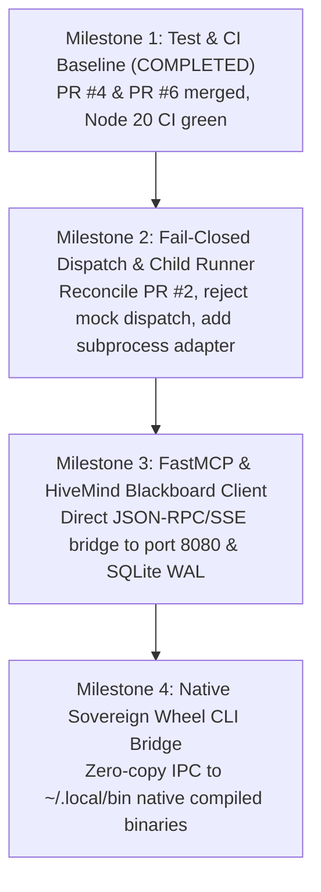

# 🔍 MIGL Sovereign Agent Suite: Reality Census & Recovery Roadmap (Task 030)

## Executive Summary
This document establishes the authentic, unvarnished physical census of `migl-sovereign-agent-suite` (`REPO_D`) following the migration to **Hive Mind Master Directive V3 (Multi-Repo Hive Federation V3)**.
In accordance with **Invariant 0.1 (Zero Judgement by Filename / Anti-Hallucination Law)** and **Directive Section 20**, all capabilities claimed in blueprints are audited against byte-level repository contents.

---

## 1. Physical Code Reality Census

| Subsystem / Claim | Status | Physical Path | Test / Verification Coverage |
| :--- | :--- | :--- | :--- |
| **Hexagonal Core Spine** | ✅ **VERIFIED REAL** | `core-spine/daemon.js` | `tests/core-spine-realpath.test.js`, `tests/daemon.test.js` (5 unit/mutant tests passing in 65ms) |
| **WHATWG URL Parser** | ✅ **VERIFIED REAL** | `core-spine/daemon.js:28` | Fixes legacy Node `url.parse` CVE warning; verified in CI runs 34877886377 and 34878378926 |
| **CI / Governance Pipeline** | ✅ **VERIFIED REAL** | `.github/workflows/ci.yml` | Node 20 runner executing `npm test` and syntax checks on push/PR |
| **Android Termux Setup** | 🟡 **SCRIPT READY** | `scripts/setup-android-termux.sh` | Bash script installing proot-distro, nodejs, python, git, duckdb in Termux |
| **Android PRoot Spec** | 📄 **SPEC SPECIFICATION** | `ANDROID_STANDALONE_SPEC.md` | Architecture specification for mobile worker orchestration |
| **100 Superpower Wheels** | 📄 **BLUEPRINT SPECIFICATION** | `100_SUPERPOWER_WHEELS_BLUEPRINT.md` | Conceptual taxonomy across 7 pillars; requires physical adapter code |
| **Executable Dispatch Adapters** | ❌ **STUB / MOCKED** | `core-spine/daemon.js:84` | Returns HTTP 200 with mock `task_id`; requires fail-closed adapter / child process executor |
| **MCP Server Adapters** | ❌ **MISSING IN REPO** | N/A | Needs FastMCP client bridge connecting to port 8080 (`spark_git_bridge.py`) |
| **Local LLM Execution Harness**| ❌ **MISSING IN REPO** | N/A | Stubs exist in docs for OpenCode, LiteLLM, Ollama; no child runner connected |

---

## 2. Identified Vulnerabilities & Gaps

1. **Mocked Dispatch False-Green**:
   - `/api/dispatch` previously returned `status: 'DISPATCHED'` without actually routing tasks to any execution engine.
   - **Remediation**: Fail-closed guard (`501 BACKEND_NOT_CONFIGURED` or input validation `400 INVALID_REQUEST`) when adapter is unconfigured, as designed in PR #2.
2. **Missing In-Repo FastMCP Client**:
   - The federation relies on `spark_git_bridge.py` (FastMCP on port 8080) and `hivemind_blackboard.db`. Repo D needs a native Node.js client to query blackboard tasks and claim work directly.
3. **100-Wheel Bridge Adapter**:
   - The host system has 50+ compiled wheels in `~/.local/bin` (`air10-auto-trigger`, `air10-fast-json`, `air10-bloom-dedup`, `air10-truth-guard`). Repo D needs a typed subprocess bridge wrapper to invoke these wheels with sub-millisecond overhead.

---

## 3. Four-Milestone Recovery Roadmap

### Milestone 1: Reality Baseline & Automated CI (STATUS: COMPLETED ✅)
- Merged PR #4 and PR #6 to main (`0f01703`).
- Added WHATWG URL parser, `npm test` script with `tests/daemon.test.js` and `tests/core-spine-realpath.test.js`.
- Hostile negative mutants verified in CI.

### Milestone 2: Intent Dispatcher Runner Adapter (STATUS: READY FOR EXECUTION 🚀)
- Reconcile PR #2 (`lane4/repo-d-issue1-failclosed-dispatch`):
  * Refuse unconfigured dispatch with `501 BACKEND_NOT_CONFIGURED`.
  * Validate request schema: return `400 INVALID_REQUEST` for malformed payloads.
  * Provide executable plug-in architecture for `opencode`, `aider`, and `antigravity` via `child_process.spawn`.
- Add test fixtures exercising both rejection and successful child spawn.

### Milestone 3: Federation Blackboard Bridge (STATUS: PLANNED 📅)
- Implement `core-spine/blackboard-client.js`:
  * Connect to `/Users/rajondas/.air1/state/hivemind_blackboard.db` via SQLite3 or HTTP RPC to `spark_git_bridge.py`.
  * Support `claim_task`, `complete_task`, and `heartbeat` methods.
  * Respect the 15-minute lease invariant (`lease_expires_at`).

### Milestone 4: Native 100-Wheel CLI Interface (STATUS: PLANNED 📅)
- Implement `core-spine/wheel-runner.js`:
  * Direct wrapper around `air10-auto-trigger`, `air10-fast-json`, `duckdb`, and `sqlite3`.
  * Auto-detection of Apple Silicon M1 acceleration paths.
